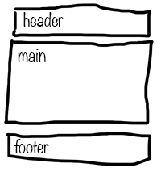
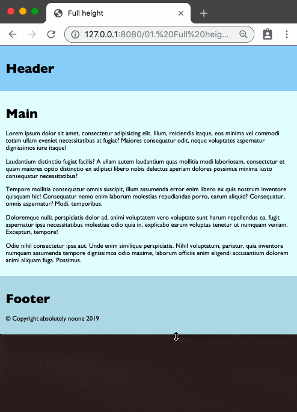

# Designchallenge
## 01. Full Height

**Create a simple webpage that is always at least the height of the window,
even when the content isn't enough to fill it.**

---

This challenge contains some materials to get you started.  
Copy everything from the `assets` folder, to the `solution` folder.  
Use the terminal, and write: `cp ./assets/* ./solution/`

---

Create the HTML for this simplistic layoutdiagram:

Create content in the structure. The header with a h1 saying "header", main with a h1 saying "main", followed by five paragraphs of lorem-ipsum text, and finally the footer has yet another h1 in it.

Then modify the CSS so that the footer touches the bottom of the window, if the content isn't long enough, like in this animation: (*the black part is the screen-background, not part of the webpage!*)

Make sure it also works with a lot of content!